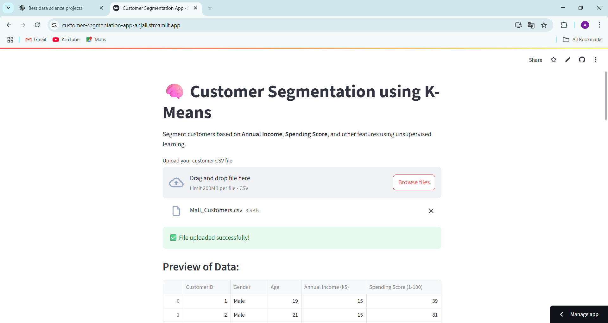
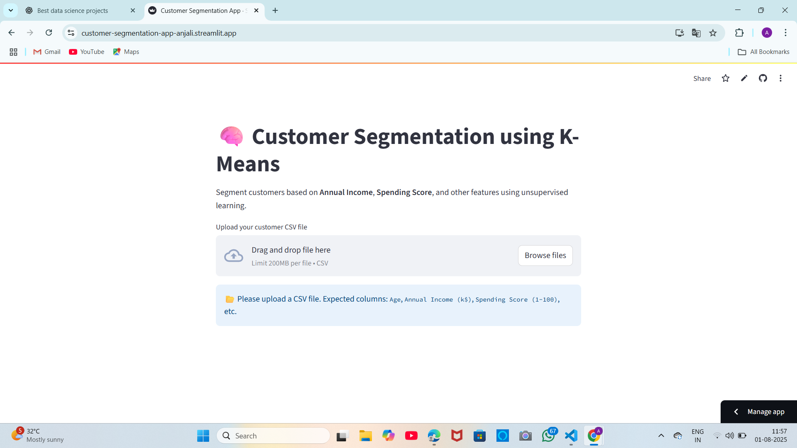

# 🧠 Customer Segmentation Dashboard using Streamlit + K-Means

This interactive web app segments customers based on **Annual Income**, **Spending Score**, and other numerical features using **unsupervised machine learning (K-Means clustering)**. It provides dynamic clustering, visual insights, and a clean UI — built with Streamlit and deployed on the cloud.

🔗 **Live App**: [customer-segmentation-app-anjali.streamlit.app](https://customer-segmentation-app-anjali.streamlit.app)  
📁 **Dataset**: `Mall_Customers.csv` (included)

---
## 📸 Screenshots

### 🔹 App After Upload


### 🔹 App Before Upload



## 🚀 Features

- 📂 Upload your own CSV file (with columns like `Age`, `Annual Income`, `Spending Score`)
- 🎚️ Select clustering features dynamically
- 🔢 Choose number of clusters (k)
- 📊 2D Cluster Visualization using Seaborn
- 📈 3D Interactive Plot using Plotly
- 📄 Cluster-wise statistical summary
- 💡 Business insights generated automatically
- ☁️ Hosted on Streamlit Cloud for instant access

---

## 🛠️ Tech Stack

- **Python**
- **Streamlit**
- **Scikit-learn** – KMeans clustering
- **Plotly** – 3D plots
- **Seaborn & Matplotlib** – 2D plots
- **Pandas / NumPy** – Data handling

---

## 📦 Getting Started

### 1. Clone the Repo

git clone https://github.com/22MH1A4242/customer-segmentation-streamlit.git
cd customer-segmentation-streamlit

2. Install Requirements
pip install -r requirements.txt
3. Run the App
streamlit run app.py

📁 Sample Dataset
You can use the included Mall_Customers.csv or upload your own with similar structure:

CustomerID	Gender	Age	Annual Income (k$)	Spending Score (1–100)
1	Male	19	15	39
2	Male	21	15	81
...	...	...	...	...

💡 Business Insights (Generated by App)
Customers with high income but low spending might need better engagement or discounts.

Young customers with high spending scores could represent trend-driven buyers.

Outliers in any cluster may represent high-value or risky segments.

👩‍💻 Author
Anjali Devi Medapati
📧 medapattanjalidevi@gmail.com
🌐 GitHub Profile
📊 Live App


---

### ✅ What You Should Do

1. Save this as `README.md` inside your GitHub repo.
2. Replace:
   - `screenshot.png` and `empty-state.png` with your actual screenshots.
3. Commit and push:
```bash
git add README.md
git commit -m "Add detailed README with features and screenshots"
git push origin main


git clone https://github.com/22MH1A4242/customer-segmentation-streamlit.git
cd customer-segmentation-streamlit
